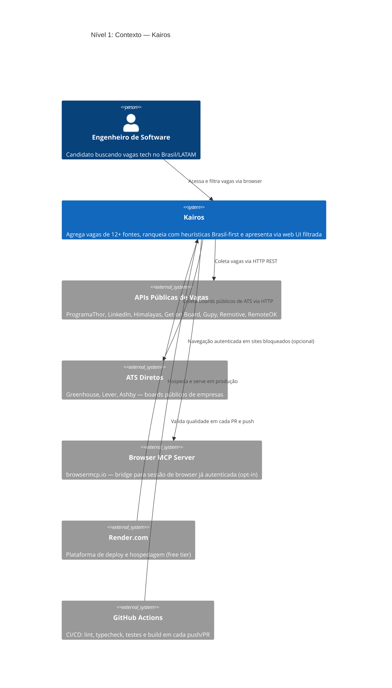
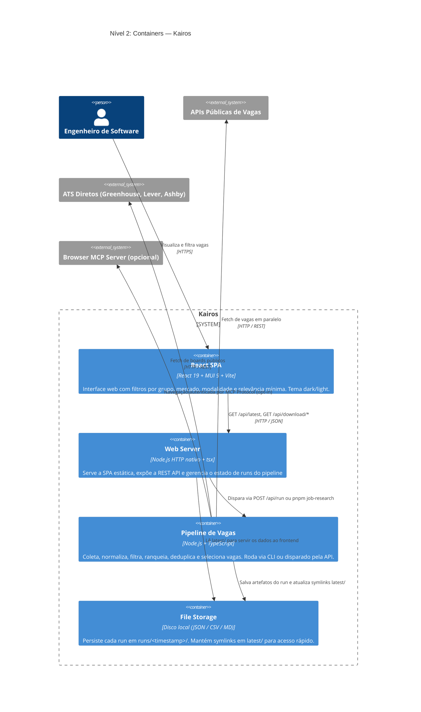
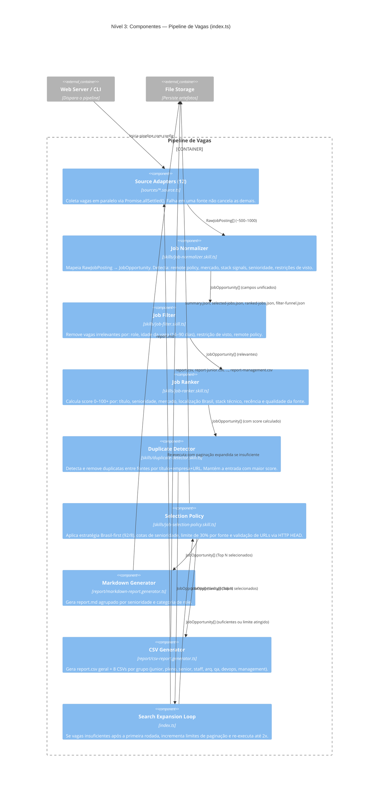

# Arquitetura — Kairos

## C4 Level 1 — Contexto do Sistema

Visão de mais alto nível: quem usa o Kairos e com quais sistemas externos ele se integra.



---

## C4 Level 2 — Containers

Os principais processos e componentes implantáveis dentro do Kairos.



---

## C4 Level 3 — Componentes do Pipeline

O pipeline é o coração do sistema. Este diagrama detalha os componentes internos e o fluxo de dados entre eles.



---

## Módulos e responsabilidades

```
src/job-research-agent/
├── index.ts                    ← Orquestrador do pipeline
├── config/                     ← Configuração central
├── domain/                     ← Tipos de domínio
├── sources/                    ← Adaptadores de fontes
│   └── browser-mcp/            ← Engine Browser MCP (opcional)
├── skills/                     ← Transformações do pipeline
├── report/                     ← Geradores de relatório
├── storage/                    ← Persistência em disco
├── shared/                     ← Utilities compartilhados
├── cli/                        ← Entry point CLI
└── web/                        ← Servidor HTTP + SPA React
    ├── server.ts
    ├── app.ts
    ├── routes/
    ├── middleware/
    ├── services/
    └── client/                 ← Frontend React (Vite)
```

### `index.ts` — Orquestrador

Coordena todas as etapas do pipeline. Implementa o loop de search expansion: se não houver vagas suficientes após a primeira rodada, incrementa os limites de paginação e re-executa fetching, normalização, filtragem e ranking antes de selecionar.

### `config/` — Configuração central

`job-research.config.ts` define a configuração default do pipeline, incluindo:
- Habilitar/desabilitar fontes individualmente
- Search queries por fonte
- Alvos de senioridade e role
- Parâmetros de scoring (pesos, thresholds)
- Configuração do Browser MCP por site
- Distribuição de senioridade no relatório

Todas as opções podem ser sobrescritas programaticamente ou via CLI flags.

### `domain/` — Tipos de domínio

Define os tipos centrais do sistema:

| Tipo | Valores |
|---|---|
| `JobMarket` | `brazil \| brazil_friendly \| latam \| international \| unclear` |
| `SeniorityLevel` | `junior \| mid_level \| senior \| lead \| staff \| principal \| staff_or_principal \| architect \| unknown` |
| `RoleCategory` | `software_engineering \| tech_lead \| devops \| software_architecture \| solutions_architecture \| cloud_architecture \| qa \| management` |
| `RemotePolicy` | `remote \| hybrid \| onsite \| unknown` |
| `SeniorityReportGroupV2` | `junior \| pleno \| senior \| staff \| arq \| qa \| devops \| management \| other` |
| `JobSourceTier` | `manual_curated \| brazil_public_api \| direct_company_board \| global_aggregator` |

### `sources/` — Adaptadores de fontes

Cada fonte implementa a interface `JobSource`:

```typescript
interface JobSource {
  fetch(config: JobResearchConfig): Promise<RawJobPosting[]>
}
```

Todas as fontes são executadas em paralelo via `Promise.allSettled()`. Falha em uma fonte não interrompe as demais.

**Fontes HTTP (11):** Manual JSON, ProgramaThor, LinkedIn, Himalayas, Get on Board, Gupy, Greenhouse, Lever, Ashby, Remotive, RemoteOK.

**Browser MCP Engine (opcional):** 10 adaptadores de sites — LinkedIn, ProgramaThor, Glassdoor, Vagas.com, Catho, InfoJobs BR, Gupy public, Trampos.co, Revelo, GeekHunter.

### `skills/` — Pipeline de transformação

| Skill | Responsabilidade |
|---|---|
| `job-normalizer` | Mapeia campos heterogêneos para `JobOpportunity` unificado |
| `job-filter` | Remove irrelevantes (role, idade, visto, remote policy) |
| `job-ranker` | Calcula `score` 0–100+ |
| `duplicate-detector` | Remove duplicatas entre fontes; mantém maior score |
| `job-market-classifier` | Classifica mercado da vaga |
| `remote-policy-detector` | Detecta modalidade (remote / hybrid / onsite) |
| `visa-restriction-detector` | Detecta restrições de visto |
| `stack-matcher` | Extrai stack técnico da descrição |
| `job-selection-policy` | Aplica Brasil-first, cotas de senioridade, diversidade de fonte |

### `report/` — Geradores de relatório

- `markdown-report.generator.ts` — `report.md` legível, agrupado por senioridade e categoria
- `csv-report.generator.ts` — `report.csv` geral + 8 CSVs por grupo

### `storage/` — Persistência

`FileJobStorage` salva todos os artefatos em `data/job-research/runs/<timestamp>/` e mantém symlinks em `data/job-research/latest/`.

**Artefatos por run:**
- `report.md`, `report.csv`, `report-*.csv`
- `summary.json`, `selected-jobs.json`, `ranked-jobs.json`, `filter-funnel.json`
- `browser-mcp-trace.json` (apenas se Browser MCP ativo)

### `web/` — Servidor HTTP e frontend

**`server.ts`** — Entry point. Em `NODE_ENV=development`, inicia o Vite dev server como middleware. Em produção, serve os arquivos pré-buildados de `dist/`.

**`app.ts`** — Roteador de APIs com middlewares globais (CORS, rate limit, auth).

**`client/`** — SPA React 19 + MUI 9 buildada com Vite. Consome `GET /api/latest`.

---

## Fluxo de dados detalhado

```
CLI flags / POST /api/run
         │
         ▼
  JobResearchAgent.run()
         │
         ├─ Promise.allSettled([11 fontes HTTP + Browser MCP opcional])
         │         │
         │         ▼ RawJobPosting[] (~500–1000)
         │
         ├─ normalize  → JobOpportunity[] (campos unificados)
         ├─ filter     → remove irrelevantes
         ├─ rank       → adiciona score 0–100+
         ├─ dedup      → remove duplicatas
         │         │
         │         ▼ (search expansion loop — até 2x se insuficiente)
         │
         ├─ selectReportJobs()
         │   ├─ 92% Brazil-first (com cotas de senioridade)
         │   ├─ 8% fallback internacional
         │   ├─ máx 30% por fonte
         │   └─ validação de URLs via HTTP HEAD
         │         │
         │         ▼ JobOpportunity[] (Top N)
         │
         ├─ MarkdownReportGenerator → report.md
         ├─ CsvReportGenerator     → report.csv + 8 CSVs por grupo
         └─ FileJobStorage         → runs/<timestamp>/ + latest/
```

---

## Decisões arquiteturais

### File-based, sem banco de dados

**Decisão:** Todos os dados são persistidos em JSON/CSV/MD no disco.

**Motivo:** Simplicidade de deploy (zero dependências externas), portabilidade, inspecionabilidade dos outputs sem ferramentas especiais.

**Limitação:** Não escala para múltiplos usuários simultâneos disparando pipelines; histórico de runs ocupa disco gradualmente.

### `Promise.allSettled()` para fontes

**Decisão:** Falha em uma fonte não cancela as demais.

**Motivo:** Fontes externas são instáveis. Um timeout no Remotive não deve impedir resultados do ProgramaThor.

### Browser MCP como double opt-in

**Decisão:** Requer habilitação global + por site.

**Motivo:** Requer Playwright instalado e sessão autenticada no browser do usuário. Deploy em servidor usa `DISABLE_BROWSER=true`.

### Score como número único (0–100+)

**Decisão:** Ranking usa um score composto.

**Motivo:** Simplifica ordenação e filtragem na UI. O detalhamento (`JobScoreBreakdown`) está disponível para debug mas não exposto na UI.

### Symlinks `latest/`

**Decisão:** `data/job-research/latest/` aponta para o run mais recente.

**Motivo:** A API e o `refresh.sh` sempre leem de `latest/` sem precisar saber o timestamp atual. Permite atualização atômica (rename) sem downtime.

---

## Pontos de extensão

| O que adicionar | Onde |
|---|---|
| Nova fonte HTTP | `sources/`, interface `JobSource`, registro em `index.ts` |
| Novo site Browser MCP | `sources/browser-mcp/site-adapters/` + registro no índice |
| Novo grupo de relatório | `domain/job.types.ts` → `skills/` → `report/csv-report.generator.ts` → frontend `utils/report-group.ts` |
| Novo sinal de stack | `skills/stack-matcher.skill.ts` + `skills/job-ranker.skill.ts` |
| Novo endpoint de API | `web/routes/` + registro em `web/app.ts` |

---

## Limitações conhecidas

- Um único pipeline por processo (sem fila; `POST /api/run` retorna 409 se já há um run ativo)
- Sem autenticação no frontend React (qualquer um com a URL acessa as vagas)
- `pnpm build:client` requer Node.js >= 20.19 ou 22.12 (Vite 8); CI roda com Node 20 que satisfaz este requisito
- Symlinks de `latest/` podem não funcionar em Windows sem privilégios de administrador ou modo Developer

## Possíveis melhorias futuras

- Agendamento automático do pipeline (cron via Render ou GitHub Actions scheduled)
- Persistência em SQLite para histórico de runs e variety tracking entre dias
- Autenticação na UI (Clerk, Auth.js ou similar)
- Paginação na API `GET /api/latest` (atualmente carrega tudo em memória)
- Webhook para notificar quando um novo run termina
- ADRs formais em `docs/DECISIONS/` à medida que decisões relevantes forem tomadas
